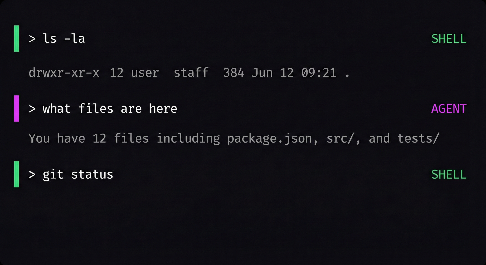
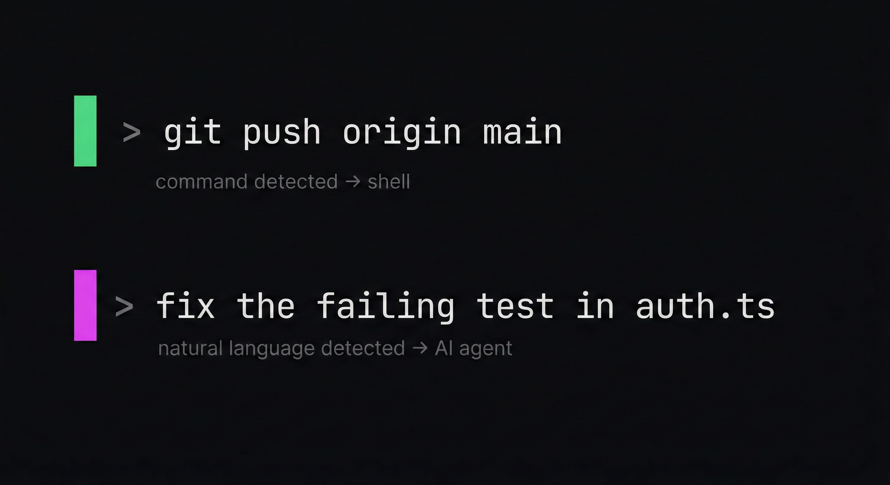

# Lacy

Talk to your shell. Type commands or natural language — it figures out which is which.

<p align="center">
  
</p>

## Install

```bash
curl -fsSL https://lacy.sh/install | bash
```

<details>
<summary>Other methods</summary>

```bash
# Homebrew
brew tap lacymorrow/tap
brew install lacy

# npx (interactive)
npx lacy

# Manual
git clone https://github.com/lacymorrow/lacy.git ~/.lacy
echo 'source ~/.lacy/lacy.plugin.zsh' >> ~/.zshrc
```

</details>

## How It Works

Real-time visual feedback shows what will happen before you hit enter:

<p align="center">
  
</p>

Commands execute in your shell. Natural language goes to your AI agent. No prefixes, no context switching — you just type.

| Input                          | Routes to  | Why                                         |
| ------------------------------ | ---------- | ------------------------------------------- |
| `ls -la`                       | Shell      | Valid command                               |
| `what files are here`          | AI         | Natural language                            |
| `git status`                   | Shell      | Valid command                               |
| `do we have a way to install?` | AI         | Reserved word — never a real command        |
| `fix the bug`                  | AI         | Multi-word, not a command                   |
| `kill the process on 3000`     | Shell → AI | Valid command, but fails — rerouted         |
| `go ahead and fix it`          | Shell → AI | "go" is valid, but "ahead" triggers reroute |
| `!rm -rf *`                    | Shell      | `!` prefix forces shell                     |

The first word of your input is also syntax-highlighted in real-time: **green** for shell commands, **magenta** for AI queries.

**Smart rerouting** (auto mode): When a valid command contains natural language patterns (3+ bare words with articles, pronouns, etc.) and fails, lacy shows a hint and automatically re-sends it to the AI agent. Shell reserved words like `do`, `then`, `in`, `else` are routed directly to the agent — they pass `command -v` but are never standalone commands.

## Modes

<p align="center">
  
</p>

| Mode      | Behavior                | Activate                     |
| --------- | ----------------------- | ---------------------------- |
| **Auto**  | Smart routing (default) | `mode auto`                  |
| **Shell** | Everything to shell     | `mode shell` or `Ctrl+Space` |
| **Agent** | Everything to AI        | `mode agent` or `Ctrl+Space` |

## Supported Tools

Lacy auto-detects your installed AI CLI. All tools handle their own auth — no API keys needed.

<p align="center">
  
</p>

```bash
tool set claude    # Use Claude Code
tool set lash      # Use Lash
tool set auto      # Auto-detect (first available)
```

Or edit `~/.lacy/config.yaml`:

```yaml
agent_tools:
  active: claude # lash, claude, opencode, gemini, codex, custom, or empty for auto
```

## Commands

| Command                     | Description          |
| --------------------------- | -------------------- |
| `mode`                      | Show current mode    |
| `mode [shell\|agent\|auto]` | Switch mode          |
| `tool`                      | Show active AI tool  |
| `tool set <name>`           | Set AI tool          |
| `ask "query"`               | Direct query to AI   |
| `Ctrl+Space`                | Toggle between modes |

## CLI

After installation, the `lacy` command is available (no Node required):

```bash
lacy setup        # Interactive settings (tool, mode, config)
lacy status       # Show installation status
lacy doctor       # Diagnose common issues
lacy update       # Pull latest changes
lacy config edit  # Open config in $EDITOR
lacy uninstall    # Remove Lacy Shell
lacy help         # Show all commands
```

## Uninstall

```bash
lacy uninstall
# or
npx lacy --uninstall
# or
curl -fsSL https://lacy.sh/install | bash -s -- --uninstall
```

## Configuration

Config file: `~/.lacy/config.yaml`

```yaml
agent_tools:
  active: claude # lash, claude, opencode, gemini, codex, or empty for auto

modes:
  default: auto # shell, agent, auto

api_keys:
  openai: "sk-..." # Only needed if no CLI tool installed
  anthropic: "sk-ant-..."
```

## Troubleshooting

**No AI response** — Check `tool` to see if a tool is detected. Install one: `npm i -g lashcode` or `brew install claude`.

**Colors not showing** — Ensure your terminal supports 256 colors (green=34, magenta=200, blue=75).

**Command rerouted unexpectedly** — In auto mode, commands with natural language patterns that fail are re-sent to the AI. Switch to `mode shell` to disable this, or prefix with `!`.

**Emergency bypass** — Prefix any command with `!` to force shell execution: `!rm -rf node_modules`

## Releasing

Requires [Bun](https://bun.sh), [gh](https://cli.github.com), and `npm login`.

```bash
bun run release          # interactive — prompts for patch/minor/major
bun run release patch    # patch bump  (1.5.3 → 1.5.4)
bun run release minor    # minor bump  (1.5.3 → 1.6.0)
bun run release major    # major bump  (1.5.3 → 2.0.0)
bun run release 2.0.0    # explicit version
```

The script handles the full release flow:

1. Bumps version in both `package.json` files
2. Commits with `release: v<version>` and tags
3. Pushes to GitHub and creates a GitHub release
4. Publishes the npm package (prompts for OTP if required)

## License

MIT — see [LICENSE](LICENSE).
